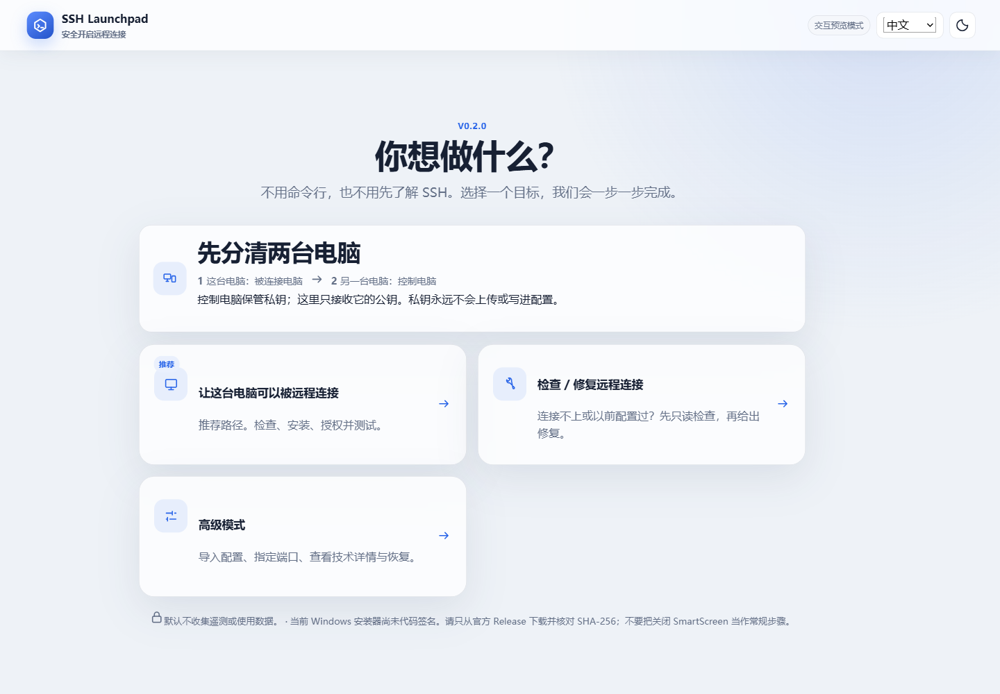

# SSH Launchpad

不用命令行，也不用先学 SSH。SSH Launchpad 用一个中文向导，让这台电脑可以被你从另一台电脑安全连接。



## Windows：下载后只做三步

1. 在 [最新 Release](https://github.com/Shallow-dusty/ssh-launchpad/releases/latest) 下载
   `SSH-Launchpad_*_Windows_x64_Installer_UNSIGNED.exe`（推荐）。
2. 双击安装并打开，首屏选择“让这台电脑可以被远程连接”。
3. 按“检查电脑 → 推荐方案 → 安全安装 → 测试连接”完成向导。

普通用户直接启动即可；真正安装系统组件时才会出现 Windows UAC 权限确认。取消确认不会继续执行。

> 当前安装器没有代码签名。请只从本仓库 Release 下载并核对 SHA-256；不要把关闭 SmartScreen
> 或安全软件当作常规解决办法。

没有桌面、需要修复或想传到另一台电脑时，下载
`SSH-Launchpad_*_Windows_x64_Portable.zip`，完整解压后双击
`开始使用 SSH Launchpad.cmd`。它已包含独立 exe、中文/英文双击入口、示例配置、
双语离线帮助和包内校验清单，不需要 Go、Node、Wails 或 PowerShell 项目环境。

## 先分清两台电脑

- **被连接电脑**：正在运行向导、等待别人连接的电脑。
- **控制电脑**：你坐在旁边，用来发起连接的另一台电脑。
- 被连接电脑只需要控制电脑的 `.pub` **公钥**。
- **私钥永远留在控制电脑**，不会上传，也不能写进 profile。

向导会检测现有公钥、允许安全生成或导入公钥/配对文件，并在最后给出可复制的连接命令。第一次连接必须核对主机指纹；本机显示绿色不等于跨设备认证已经成功。

## 安全默认值

- 默认只允许 Tailscale 私有网络设备访问；Tailscale 是推荐项，不是 SSH 的硬依赖。
- Check 和 Plan 只读；Verify 不提权。
- Apply 会逐项说明“安装什么、打开哪个端口、谁能连接”后再确认。
- 如果操作可能切断当前唯一 SSH/Tailscale 连接，默认阻止并给出本地执行、第二通道或延迟验证方案。
- 重复运行只处理差异；失败后停止后续步骤并按执行记录恢复可逆改动。
- 下载必须使用可信 HTTPS 来源并通过 SHA-256，不会关闭 TLS 校验。
- 默认不收集遥测；导出的支持报告会脱敏主机名、IP、用户名路径、公钥注释和凭据样式字段。

## Portable 与离线

Windows、Linux 和 macOS portable 包都包含单文件 CLI，不需要预装项目运行时。macOS 包带
`.command` 入口；Linux 包带终端 `.desktop` 入口。未签名 macOS 文件可能触发 Gatekeeper，
Linux 文件管理器也可能要求先允许执行；详情见包内双语离线帮助。

工具本身可以完全离线运行。若目标系统尚未安装 OpenSSH 或可选 Tailscale，完整离线 Apply
还需要相应平台依赖。仓库提供
[`new-offline-pack`](docs/offline-pack.md) 命令生成带来源、许可声明和 SHA-256 的本地依赖包；
不具备再分发许可的第三方安装器不会进入源码或标准 Release。

## CLI 与自动化

无参数运行会进入与 GUI 同样的小白向导。`--lang auto|zh-CN|en` 或
`SSH_LAUNCHPAD_LANG` 控制语言；重定向、CI 或 `--non-interactive` 时绝不等待输入。

```text
ssh-launchpad check --output check.json
ssh-launchpad plan --profile profiles/example.yaml --output plan.json
ssh-launchpad apply --profile profiles/example.yaml --yes
ssh-launchpad verify --profile profiles/example.yaml --output verify.json
```

机器 JSON 字段和退出码始终保持稳定英文，不因界面语言变化。Windows 控制台由程序临时启用
UTF-8 并在退出时恢复；JSON/日志为 UTF-8 no BOM。非 UTF-8 的 Linux/macOS locale
安全回退英文 ASCII。

## English

Download the recommended unsigned Windows installer from the
[latest Release](https://github.com/Shallow-dusty/ssh-launchpad/releases/latest), open it, and follow
the guided UI. Choose the portable package for servers or repair; extract the complete archive and
open `Start SSH Launchpad.cmd`. The language switch is always available and persists.

## 文档

- [当前状态](STATUS.md)
- [版本变化](CHANGELOG.md)
- [项目编年史](CHRONICLE.md)
- [平台支持与验证边界](docs/platform-support.md)
- [架构](docs/architecture.md)
- [网络与下载策略](docs/network-download-strategy.md)
- [离线依赖包](docs/offline-pack.md)
- [威胁模型](docs/threat-model.md)
- [故障排查与恢复](docs/troubleshooting.md)
- [开发与构建](docs/development.md)
- [Release 验证](docs/release-verification.md)
- [安全策略](SECURITY.md)

MIT License。
